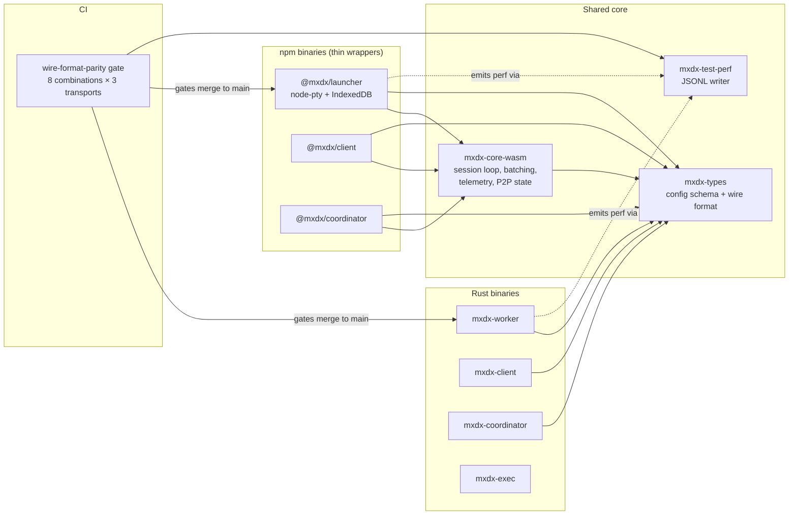

# ADR: Rust / npm Binary Parity Convergence

**Date:** 2026-04-29
**Status:** Accepted
**Decision makers:** Project owner + parallel-mode subagent + star-chamber council

## Context

The mxdx project ships two parallel runtime stacks that implement overlapping but divergent feature surfaces:

- **Rust binaries:** `mxdx-worker`, `mxdx-client`, `mxdx-coordinator`, `mxdx-exec`
- **npm binaries:** `@mxdx/launcher`, `@mxdx/client`, `@mxdx/coordinator`, `@mxdx/cli`

The accompanying research document (`docs/research/2026-04-29-rust-npm-binary-parity-research.md`) catalogues the divergences across nine dimensions: binary inventory, CLI surface, feature matrix, test coverage, build/release coupling, configuration files, logging, exit codes, environment variables, signal handling, and dependency versions.

Six gaps drive this ADR:

1. **Config schema incompatibility** — both runtimes write to `$HOME/.mxdx/worker.toml` and `$HOME/.mxdx/client.toml` but in incompatible TOML layouts (Rust: flat top-level keys; npm: `[launcher]` and `[client]` section wrappers). A config file written by one runtime is silently zero-fielded when read by the other.
2. **Wire-format-parity CI gate is missing** — ADR `2026-04-16-coordinated-rust-npm-releases.md` mandates this gate. It does not exist. The interop test file (`packages/e2e-tests/tests/rust-npm-interop-beta.test.js`) defines 8 cross-runtime combinations; 6 are skipped placeholders, and the 2 that are "implemented" pass an undefined `--p2p` flag that crashes `mxdx-worker` at clap parse time.
3. **Feature surface asymmetry** — features exist only in npm (`verify`, `launchers`, `telemetry display`, `reload`, `--telemetry summary`, `--log-format`, `--use-tmux`, `--registration-token`, `--admin-user`, `--config`, `--batch-ms`, `--p2p-batch-ms`, `--p2p-advertise-ips`, `--p2p-turn-only`, `--format text|json`) or only in Rust (`daemon`, `mcp`, `trust`, `attach`, `ls`, `logs`, `cancel`, `--no-daemon`, `--profile`, exit codes 10/11/12, `diagnose`).
4. **WASM convergence stalled** — the existing memory commitment ("implement in Rust, expose via WASM") is contradicted by 2000+ lines of session-loop logic in `packages/launcher/src/runtime.js`. The npm launcher is a parallel implementation, not a thin WASM consumer.
5. **Performance test output non-uniform** — npm tests write JSONL via `writePerfEntry()` to `TEST_PERF_OUTPUT`; Rust `e2e_profile.rs` writes raw log lines via `worker_log_path()`. The two outputs cannot be cross-compared without manual scraping.
6. **Test classification fraud** — multiple test files in `packages/e2e-tests/` describe themselves as E2E but call `WasmMatrixClient` directly without spawning a binary subprocess, violating CLAUDE.md's E2E definition.

## Decision

The project will adopt a five-pillar convergence architecture, with parity enforced by a hard CI gate and a documented two-tier feature classification.

### Pillar 1 — Config schema: Rust flat layout is canonical

Both runtimes read flat top-level TOML keys. The npm config parsers in `packages/launcher/src/config.js` and `packages/client/src/config.js` are rewritten to drop the `[launcher]` and `[client]` section wrappers. npm-only fields with no current Rust equivalent (`telemetry`, `use_tmux`, `batch_ms`, `p2p_batch_ms`, `p2p_advertise_ips`, `p2p_turn_only`, `registration_token`, `admin_user`) are added as flat fields to `mxdx-types::WorkerConfig` / `mxdx-types::ClientConfig`. Existing npm-written config files break on first read after upgrade — onboarding wizard rewrites the config in the new layout.

### Pillar 2 — Wire-format-parity CI gate: all 8 combinations gating before any parity feature work

Implementation order:

1. Fix the `--p2p` clap-parse bug in t1a/t1b — either remove the flag from the test invocation or define `--p2p` on the worker.
2. Complete `mxdx-5qp` — wire npm subprocess spawning (`node mxdx-launcher.js`, `node mxdx-client.js`) into `rust-npm-interop-beta.test.js`.
3. Implement t2a/t2b/t3a/t3b/t4a/t4b — populate the six skipped placeholders.
4. Make the `wire-format-parity` job in `.github/workflows/ci.yml` mandatory: PRs that fail any of the 8 combinations cannot merge.
5. The gate uses local Tuwunel instances (`/usr/sbin/tuwunel`) for combinations that don't require beta credentials; combinations requiring beta credentials run in the existing `e2e-beta` workflow.

No parity feature work (Pillar 3, 4, 5) merges until the gate is mandatory and green.

### Pillar 3 — WASM expansion with documented thin JS wrappers

The npm launcher session loop is reduced to a thin JavaScript shim. All session-management logic — batching, telemetry emission, P2P state machine, session lifecycle, command dispatch — moves into `crates/mxdx-core-wasm` and is exposed through wasm-bindgen.

Features that cannot run in WASM remain as JS thin wrappers; each such wrapper MUST contain a doc comment naming its equivalent Rust function. The full enumerated list of accepted JS-side wrappers:

| JS wrapper | OS-bound reason | Documented Rust equivalent |
|---|---|---|
| `packages/launcher/src/pty-bridge.js` | `node-pty` native addon | `crates/mxdx-worker/src/bin/mxdx_exec.rs` (tmux + Unix-socket exit-code channel) |
| IndexedDB persistence in `packages/core/index.js` | Browser/Node-only API | `matrix-sdk` SQLite store in `crates/mxdx-worker/src/lib.rs` |
| OS keychain access (when added) | Per-OS API not in WASM | `crates/mxdx-secrets` (existing crate) |
| P2P socket creation via `node-datachannel` | Native libdatachannel binding | `crates/mxdx-p2p` (datachannel-rs vendored binding) |
| Inquirer onboarding wizard | Interactive prompt requires Node TTY | None — onboarding is intentionally npm-only (Pillar 4) |
| Subprocess spawning for `mxdx-exec` | `child_process` for Node, `std::process` for Rust | `crates/mxdx-worker/src/bin/mxdx_exec.rs` |
| `packages/launcher/src/session-mux.js` (PTY I/O mux) | `node-pty` data-event subscription is per-session and OS-bound | None — PTY I/O routing is `node-pty`-bound; no WASM equivalent (session *state* tracking lives in `crates/mxdx-core-wasm/src/lib.rs::WasmSessionManager` / `SessionTransportManager`) |

### Pillar 4 — Two-tier feature classification

Features are classified as either **interop-required** (must close in both runtimes) or **runtime-native** (accepted permanent asymmetry). The classification is authoritative in this ADR; future amendments require a successor ADR.

**Runtime-native (deny-list — accepted asymmetry).** The user's "full parity except inquirer" instruction directs npm-only features to move to Rust. It does not require Rust-only features to move to npm. The deny-list captures both directions for completeness, but the directionality is recorded so future readers know which entries derive from user intent vs structural necessity.

**Sub-table 4a: npm-only accepted asymmetry (user-stated exclusions):**

| Feature | Reason |
|---|---|
| Inquirer onboarding wizard | Interactive prompt requires Node TTY; user explicitly excluded from parity scope during questionnaire. |

**Sub-table 4b: Rust-only accepted asymmetry (structural exclusions):**

| Feature | Reason |
|---|---|
| `daemon` / `mcp` subcommands | Unix-socket IPC is structurally bound to Rust process model; no equivalent in WASM/Node session lifetime; subprocess delegation from npm would contradict the thin-wrapper-only rule of Pillar 3. |
| `--no-daemon` global flag | Daemon architecture is Rust-specific; npm has no daemon to disable. |
| `--profile` global flag | Daemon profile selection has no npm analog; tied to Rust daemon state directory. |

**Sub-table 4c: Both-directional asymmetry (implementation differs by runtime, UX is unified):**

| Feature | Reason |
|---|---|
| PTY backend implementation | Rust uses tmux + `mxdx-exec`; npm uses `node-pty`. UX surface (`shell`/`attach`) is unified per requirement 24; backend choice is by-runtime. |

**Interop-required (must close — both directions):**

Everything not in the runtime-native list. Concretely, Rust must gain implementations of all currently npm-only features:

- `verify <user_id>` cross-signing command
- `launchers` (list discovered launcher spaces)
- `telemetry display` (read-only telemetry view command)
- `reload` (config reload without restart)
- `--telemetry full|summary` mode selection
- `--log-format json|text` structured log output selection
- `--use-tmux auto|always|never` PTY backend selection
- `--registration-token` Matrix registration token support
- `--admin-user` admin authorization flag
- `--config <path>` explicit config file path
- `--batch-ms` send batching window tuning
- `--p2p-batch-ms`, `--p2p-advertise-ips`, `--p2p-turn-only` P2P CLI tuning surface
- `--format text|json` (client output format)
- `mxdx-coordinator` full implementation (npm coordinator currently a stub)

npm must gain implementations of all currently Rust-only features (excluding the runtime-native list):

- `attach <uuid>` (Rust attach is currently a stub; npm attach UX exists as `shell <launcher>` — unify on a single addressing model in Pillar 5)
- `ls` (list sessions)
- `logs <uuid> [--follow]` (view session logs)
- `cancel <uuid>` (cancel session)
- `--detach` (run in detached mode)
- `--no-room-output`, `--timeout`, `--cwd`, `--worker-room`, `--skip-liveness-check` flags on exec
- `trust list|add|remove|pull|anchor` subcommands
- `diagnose` runtime diagnostic
- Liveness-failure exit codes 10 / 11 / 12

### Pillar 5 — Unified test infrastructure and performance output

A new helper crate `mxdx-test-perf` provides a Rust API to emit JSONL entries matching the npm `writePerfEntry()` schema. All Rust E2E tests adopt this helper. The shared output format flows through `TEST_PERF_OUTPUT` for both runtimes; `scripts/e2e-test-suite.sh` consumes a single unified stream.

Misclassified E2E tests (those calling `WasmMatrixClient` directly without spawning binary subprocesses) are renamed to integration tests and moved to a sibling `integration/` directory. A CI lint step rejects any test under `e2e-tests/` that does not spawn at least one binary subprocess. Interop combinations are generated programmatically using Vitest's `describe.each` over `{client_runtime, worker_runtime, hs_topology}` to prevent N×M drift.

CLI surface canonicalization for the interop-required tier follows Rust clap conventions: repeatable flags (`--allowed-command` not `--allowed-commands` comma-separated), kebab-case, `--no-X` toggles. The npm commander definitions are migrated to the Rust naming.

## Requirements (RFC 2119)

### Pillar 1 — Configuration schema

1. The on-disk format of `$HOME/.mxdx/worker.toml` and `$HOME/.mxdx/client.toml` MUST be flat top-level TOML keys with no `[launcher]` or `[client]` section wrapper.
2. The Rust `mxdx-types::WorkerConfig` and `mxdx-types::ClientConfig` structs MUST be the canonical schema; both Rust and npm runtimes derive their parsing from these definitions.
3. Existing npm fields without Rust equivalents (`telemetry`, `use_tmux`, `batch_ms`, `p2p_batch_ms`, `p2p_advertise_ips`, `p2p_turn_only`, `registration_token`, `admin_user`) MUST be added as first-class fields to the Rust types.
4. The npm onboarding wizard (`packages/launcher/src/onboarding/`) MUST emit config files in the canonical flat layout.
5. Both runtimes' config parsers MUST tolerate (ignore) unknown TOML keys without erroring, to allow forward compatibility with future fields.
6. Both runtimes' config writers MUST NOT silently overwrite fields outside their concern when persisting partial updates.
6a. **(Blocker — added per star-chamber review)** Both runtimes MUST detect a `worker.toml` or `client.toml` containing a `[launcher]` or `[client]` section header (the legacy npm layout) on startup. On detection they MUST either (a) automatically migrate the file to the canonical flat layout with a warning logged to stderr (preserving the original file at `<path>.legacy.bak`), or (b) print a diagnostic error naming the migration command and exit with a non-zero exit code. Silent zero-fielding of a config containing security-critical fields (`authorized_users`, `allowed_commands`, `trust_anchor`) is a security defect, not graceful degradation. The migration path MUST be implemented before Pillar 1 config schema changes ship in any release artifact.

### Pillar 2 — Wire-format-parity CI gate

7. The `wire-format-parity` job in `.github/workflows/ci.yml` MUST execute all 8 combinations of `{client_runtime: rust|npm} × {worker_runtime: rust|npm} × {hs_topology: same|federated}` defined in `packages/e2e-tests/tests/rust-npm-interop-beta.test.js`.
8. The `wire-format-parity` job MUST be required for PR merge in branch protection rules.
9. The `--p2p` flag passed to `mxdx-worker` in t1a and t1b MUST either be removed from the test invocation or defined as a real clap flag on the worker before t1a/t1b run.
10. The 6 currently-skipped combinations (t2a, t2b, t3a, t3b, t4a, t4b) MUST be implemented with real npm-binary subprocess spawning before the gate becomes mandatory.
11. Combinations that do not require beta credentials MUST run against local Tuwunel instances managed by the existing `TuwunelInstance` test helper.
12. No parity feature work covered by Pillars 3, 4, or 5 MAY merge until the wire-format-parity gate is mandatory and green on `main`.
8a. **(Major — added per star-chamber review)** The branch protection rule for `wire-format-parity` MUST specify an emergency override policy. The policy MUST require: (a) explicit written justification in the PR body naming the failing combination by ID (e.g., "t3a is red due to issue #N — unrelated to this PR's changes"); (b) project-owner approval; and (c) a linked tracking issue with a deadline for restoring the gate to green. Override invocations MUST be logged in `docs/adr/overrides/` with date, PR number, justification, and deadline. Security fixes to non-parity code MUST be processable within 24 hours even when a parity gate is red.
12a. **(Blocker — added per star-chamber review)** The `wire-format-parity` gate MUST define an explicit "green" policy before being enabled as a required check. The policy MUST specify: (a) the maximum number of automatic retries per combination before marking the combination as failed rather than flaky (suggested: 2 retries); (b) the quarantine mechanism by which a single combination MAY be flagged `[flaky-quarantine]` and excluded from the blocking gate while a tracking issue is open (suggested: ≤14 day quarantine); and (c) the time bound after which a quarantined combination MUST either be fixed or reclassified as runtime-native via ADR amendment. P2P combinations MUST begin in non-blocking advisory mode and SHOULD be promoted to blocking only after 10 consecutive green runs across distinct CI runner environments.

### Pillar 3 — WASM expansion and documented JS wrappers

13. The npm launcher session-execution loop logic in `packages/launcher/src/runtime.js` MUST migrate into `crates/mxdx-core-wasm` such that the JS file is reduced to the OS-bound thin-wrapper concerns enumerated in this ADR.
14. Every JS file that wraps an OS-bound operation that has a Rust equivalent MUST contain a doc comment in the file header naming the Rust crate, file, and function (or struct) that implements the same logic on the Rust side.
15. The cross-reference doc comments MUST take the form: `// Rust equivalent: <crate-path>::<file>::<function-or-struct>` so that they are greppable.
16. New JS code MUST NOT add OS-unbound logic in the launcher runtime; OS-unbound logic MUST be added to `mxdx-core-wasm` and consumed via wasm-bindgen.
17. The JS thin-wrapper layer MUST NOT exceed the OS-bound concerns enumerated in this ADR; expansions to the wrapper layer require an ADR amendment.
18. The build pipeline MUST produce both `nodejs` and `web` WASM targets (`packages/core/wasm/nodejs/` and `packages/core/wasm/web/`) and MUST fail the build if either target is missing.
13a. **(Blocker — added per star-chamber review)** Migration of session-execution logic from `packages/launcher/src/runtime.js` into `crates/mxdx-core-wasm` MUST be preceded by a security review document under `docs/reviews/security/` that (a) enumerates each Matrix send call in the migrated code path and confirms each MUST be encrypted on the wire under MSC4362 (`experimental-encrypted-state-events`); (b) identifies any cryptographic primitives (AES-GCM, key derivation, nonce generation) used in the migrated code and confirms the Rust equivalents are behaviorally identical to the JS originals; (c) confirms that the new WASM public API does not expose crypto state (private keys, megolm session secrets, serialized olm session state) to the JS caller. No PR implementing Pillar 3 logic migration MAY merge without a linked security review document approved by the project owner.

### Pillar 4 — Two-tier feature classification

19. Features classified as **interop-required** in this ADR MUST be implemented in both Rust and npm before the next minor release.
20. Features classified as **runtime-native** in this ADR MUST NOT be implemented in the non-owning runtime; PRs adding a runtime-native feature to its non-owning runtime MUST be rejected unless accompanied by an ADR amendment moving the feature to interop-required.
21. The wire-format-parity gate (Pillar 2) MUST exercise every interop-required feature in its test matrix; an interop-required feature without test coverage in the gate is a defect.
22. CLI flags for interop-required features MUST follow Rust clap conventions: kebab-case, repeatable flags rather than comma-separated values, and `--no-X` toggles for boolean disable.
23. The npm `mxdx-coordinator` package MUST be implemented to feature parity with the Rust `mxdx-coordinator` binary; a stub implementation that prints "not yet connected to Matrix" is non-conforming.
24. The Rust `mxdx-client attach` subcommand MUST be implemented to feature parity with the npm `mxdx-client shell` subcommand; both MUST share a single addressing model defined in `crates/mxdx-types`.
22a. **(Minor — added per star-chamber review)** The environment variable surface (`MXDX_HOMESERVER`, `MXDX_USERNAME`, `MXDX_PASSWORD`, `MXDX_ROOM_ID`) is interop-required, not runtime-native. npm binaries that accept a corresponding CLI flag MUST read the matching `MXDX_*` env var as a fallback, matching the Rust clap `env()` behavior.

### Pillar 5 — Unified test infrastructure

25. A Rust helper crate `mxdx-test-perf` MUST exist and MUST emit JSONL entries with field schema identical to npm's `writePerfEntry()` (suite, transport, runtime, duration_ms, rss_max, plus extension fields).
26. All Rust E2E tests under `crates/*/tests/e2e_*.rs` (or equivalent) MUST emit performance entries via `mxdx-test-perf`; raw log emission as the sole performance-data path is non-conforming.
27. Both runtimes' E2E tests MUST write performance data to the same `TEST_PERF_OUTPUT` path; the unified stream MUST be parseable as JSONL by `scripts/e2e-test-suite.sh`.
28. **(Revised per star-chamber review)** Tests under `packages/e2e-tests/` that do not spawn at least one binary subprocess MUST be split: the non-subprocess test logic MUST be extracted into `packages/integration-tests/` and the file under `e2e-tests/` MUST retain only the subprocess-spawning test blocks. A CI lint step MUST be added to `.github/workflows/ci.yml` that statically verifies every `describe` or `test` block under `packages/e2e-tests/` contains at least one `spawn` / `execFile` / `spawnSync` invocation; a test block with no subprocess call fails the lint. The lint MUST be added before any test reclassification work begins, and MUST initially run in warn-only mode for 5 business days to surface false positives before becoming blocking.
29. Cross-runtime test combinations MUST be generated via `describe.each`-style parameterization over `{client_runtime, worker_runtime, hs_topology}` rather than hand-written N×M test files; per-runtime setup differences MAY be handled via setup/teardown hooks within the parameterized body.
30. Performance tests MUST cover both Rust and npm code paths with equivalent transports (same-HS, federated, P2P); a transport covered for one runtime but not the other is a defect.
31. End-to-end tests for the binary surface MUST run against compiled binaries spawned as subprocesses; library-level tests MUST NOT be classified as E2E even if they appear under an `e2e/` directory tree.
25a. **(Minor — added per star-chamber review)** Both Rust and npm client binaries MUST handle `SIGTERM` and `SIGINT` with a graceful shutdown path that flushes any pending Matrix key uploads and logs a structured exit event before exiting. Abrupt kill without OLM session flush is a crypto store consistency risk. This requirement applies to both direct-mode (non-daemon) Rust client and npm client. The wire-format-parity gate SHOULD include a test combination that sends `SIGTERM` mid-session and verifies the session resumes (rather than re-establishes) on restart.
28a. **(Major — added per star-chamber review)** The four specifically misclassified test files identified in the research (`launcher-commands.test.js`, the `WASM Client` block in `public-server.test.js`, `p2p-signaling.test.js`, and the `WASM: Room Topology` block in `launcher-onboarding.test.js`) MUST be migrated before the `wire-format-parity` gate becomes mandatory; their migration is a prerequisite for gate activation, not a follow-up.

## Rationale

**Pillar 1 (Rust flat schema):** The Rust `mxdx-types` crate already exposes the canonical wire-format types and is consumed by both runtimes via WASM and direct Rust use. Co-locating the config schema with the wire-format types prevents schema definition from spreading across multiple authorities. Selecting Option B (npm adopts Rust) over Option C (versioned migration) trades onboarding-wizard rework for permanent simplicity — the migration path has long-tail support cost, the onboarding rework is one-time and contained.

**Pillar 2 (hard CI gate before parity work):** The convergence architecture is a multi-quarter effort. Without an enforcement gate, divergence accumulates faster than convergence work fixes it. The gate establishes the test matrix as the contract; every other pillar is verified through it. Selecting Option A over Option B (start small) reflects the project owner's priority — the security-critical nature of the system means partial coverage is unacceptable, and the upfront infrastructure investment is one-time.

**Pillar 3 (WASM expansion with documented wrappers):** The architectural commitment in memory ("implement in Rust, expose via WASM") cannot remain aspirational. The thin-wrapper documentation requirement is a long-term governance commitment — it ensures that future contributors looking at JS code know where the Rust truth lives, preventing JS-only logic from silently re-accumulating. Selecting Option A over Option C (esbuild model) preserves the browser/web-console crypto path and avoids forcing all users through a SQLite migration that breaks Megolm session continuity.

**Pillar 4 (two-tier classification):** Full parity (Option A) is incoherent with daemon/MCP being structurally Unix-bound and with onboarding requiring a TTY. The narrow runtime-native deny-list (3 items) preserves the user's stated goal of "full parity except inquirer onboarding" while honestly capturing the structural exceptions. Tying the interop-required tier definition to the wire-format-parity test matrix makes the classification automatically testable rather than aspirational.

**Pillar 5 (unified test output and classification):** Equal performance coverage across runtimes is a stated user goal. Schema unification is the minimum-cost path to direct A/B comparison. Reclassifying misclassified E2E tests is a security hygiene requirement — for an E2EE security service, a false-green E2E gate is a process failure that could mask cryptographic regressions.

## Alternatives Considered

### Versioned schema migration (Pillar 1, Option C)
- Pros: Clean break; embedded version field; future incompatibilities detectable.
- Cons: Adds tooling that users must run (or auto-runs and surprises); long-tail support cost on a project with a small user base.
- Why rejected: The migration overhead exceeds the cost of a one-time onboarding-wizard rewrite.

### Section-wrapped schema with npm canonical (Pillar 1, Option A — Rust adopts npm sections)
- Pros: npm files become Rust-readable without changes.
- Cons: Rust schema is richer; encoding it under npm section names requires nested sub-sections; loses the Rust-as-source-of-truth principle.
- Why rejected: Contradicts the broader convergence-toward-Rust commitment in Pillar 3.

### Start-small CI gate (Pillar 2, Option B — 2 of 8 combinations, expand iteratively)
- Pros: Unblocks parity work immediately.
- Cons: Partial coverage gives false confidence; the remaining 6 combinations may indefinitely stall as "tracked backlog."
- Why rejected: For a security-critical project, partial wire-format parity is indistinguishable from no parity; the project owner explicitly chose the harder path.

### Freeze WASM, keep npm as parallel implementation (Pillar 3, Option B)
- Pros: Eliminates WASM-build fragility from expansion.
- Cons: Doubles security audit surface in perpetuity; contradicts stated architectural commitment; cross-runtime session resumption permanently impossible.
- Why rejected: Unacceptable for an E2EE security service.

### esbuild thin-shim model (Pillar 3, Option C — npm downloads Rust binary)
- Pros: Single implementation; SQLite-only crypto store.
- Cons: Breaks browser/web-console crypto path; forces user-visible Megolm session migration; Windows support contingent on Unix-socket removal in `mxdx-exec`.
- Why rejected: User-visible security event (re-verify all devices) is unacceptable; web-console is a load-bearing surface.

### Full bidirectional parity (Pillar 4, Option A — no asymmetry tier)
- Pros: Simplest user message ("yes, both have it").
- Cons: Architecturally incoherent — daemon/MCP can't run in WASM; inquirer requires TTY; PTY backends are platform-bound.
- Why rejected: Forces compromises on otherwise-clean structural boundaries.

### Separate perf format with downstream analyzer (Pillar 5, Option C)
- Pros: Zero code change in either runtime.
- Cons: Permanent drift risk; new metrics in one runtime won't appear in unified report until analyzer updated; doesn't satisfy "cover both code paths equally."
- Why rejected: Cements the gap rather than closing it.

## Assumed Versions (SHOULD)

- `matrix-sdk`: 0.16 (Rust)
- `clap`: 4 (Rust, derive + env features)
- `commander`: 14 (npm)
- `tokio`: 1 (Rust, full features)
- `serde` / `serde_json`: 1 (Rust)
- `aes-gcm`: 0.10 (Rust); Web Crypto API (npm)
- `ed25519-dalek`: 2 (Rust)
- `datachannel`: 0.16 (Rust, vendored libdatachannel binding)
- `node-datachannel`: 0.32 (npm)
- `zod`: 4 (npm)
- `inquirer`: 13 (npm)
- `smol-toml`: 1.6 (npm)
- `toml`: 0.8 (Rust)
- `rustc`: 1.93.1 (pinned in `dtolnay/rust-toolchain@1.93.1` due to a 1.94.0 trait solver regression affecting `matrix-sdk` compilation). Pillar 3 work MUST compile cleanly against 1.93.1 before merging. The pin SHOULD be revisited as a tracked item; unblocking it is a prerequisite for upgrading `matrix-sdk` past 0.16.
- `wasm-bindgen`: MUST be pinned to a specific version in `Cargo.toml` (not a range). The `wasm-bindgen-cli` and `wasm-pack` versions used in CI MUST match the `wasm-bindgen` version recorded in `Cargo.lock`. Mismatch produces a runtime panic at WASM instantiation. ADR amendment required to upgrade.
- `wasm-pack`: MUST be pinned to a specific version in CI tool installation; "latest" is not acceptable because `wasm-pack` and `wasm-bindgen` MUST be co-versioned. ADR amendment required to upgrade.
- Vitest: pinned in `package.json`; "latest stable" is not acceptable for a release-gating test framework.
- Tuwunel: 1.5

**P2P cryptographic verification (added per star-chamber review).** The `node-datachannel` (0.32) and `datachannel` (0.16) versions bind different major API versions of `libdatachannel`. A functional round-trip test alone is insufficient; before any cross-runtime P2P combination is declared conforming, a dedicated security verification MUST confirm: (a) mutual DTLS fingerprint acceptance (Rust-initiated session is accepted by npm peer and vice versa); (b) that neither side silently falls back to an unencrypted transport when DTLS negotiation fails; (c) that the AES-GCM key material used for application-layer P2P encryption is derived identically in both code paths. This verification MUST be documented in `docs/reviews/security/` and linked from the wire-format-parity gate test that covers P2P combinations. The gate MUST assert that an established P2P session is encrypted (e.g., a Rust worker MUST NOT decrypt a session payload initiated by an npm client without a successful key exchange). Either dependency upgrade is gated on re-running this verification.

## Diagram

## Consequences

**Positive:**
- The convergence-to-Rust commitment becomes operational rather than aspirational.
- Cross-runtime regressions are caught at CI time, not in production.
- Performance comparison between runtimes is a single query against unified JSONL data.
- The two-tier feature classification gives contributors a clear mental model for where new features live.
- Long-term security audit surface shrinks as JS session-loop logic migrates into auditable Rust.

**Negative / risks:**
- Pillar 2 (gate before parity work) front-loads infrastructure work; parity feature delivery starts later than alternative orderings.
- Pillar 1 breaks existing npm-written config files; users will need to re-run onboarding or have the wizard auto-migrate. A migration helper SHOULD be considered as a follow-up if real users surface.
- Pillar 3 increases the WASM build surface; build failures in the WASM pipeline now affect more features than before.
- Pillar 4's two-tier classification adds a governance artifact that requires future ADR amendments to modify; over-conservative interpretation could indefinitely defer real gaps.
- The `node-datachannel` 0.32 vs `datachannel` 0.16 version skew is a known interop risk; the wire-format-parity gate MUST exercise P2P round-trip to catch protocol drift.

**Follow-up work expected (non-binding sketch — `/brains:map` will produce the authoritative plan):**
1. Fix `--p2p` clap-parse bug; close `mxdx-5qp`; implement t2a-t4b with subprocess spawning.
2. Make `wire-format-parity` job mandatory in branch protection.
3. Rewrite npm config parsers for flat schema; rewrite onboarding wizard.
4. Migrate session-loop logic from `runtime.js` to `mxdx-core-wasm`; add JS-Rust cross-reference doc comments.
5. Implement Rust-side interop-required features (`verify`, `launchers`, `telemetry display`, `reload`, `--telemetry`, `--log-format`, `--use-tmux`, `--registration-token`, `--admin-user`, `--config`, `--batch-ms`, `--p2p-batch-ms`, `--p2p-advertise-ips`, `--p2p-turn-only`, `--format`, full `mxdx-coordinator`).
6. Implement npm-side interop-required features (`attach`/`shell` unification, `ls`, `logs`, `cancel`, `--detach`, `trust` subcommands, `diagnose`, exit codes 10/11/12).
7. Create `mxdx-test-perf` crate; migrate Rust E2E tests to emit JSONL.
8. Reclassify misclassified E2E tests; add CI lint enforcing the binary-subprocess requirement.
9. Refactor `rust-npm-interop-beta.test.js` to use `describe.each` parameterization.
10. Run full E2E suite on all produced binaries (Rust + npm × all interop combinations × all transports); confirm performance parity.

## Council Input

The draft ADR was sent for adversarial review by `pragma:star-chamber` (multi-LLM craftsmanship council) per BRAINS phase-1 `--parallel` mode. The council identified 11 issues across four review dimensions (soundness, version choices, missing concerns, testability). All 11 were folded into the requirements above; the integration map:

| Council issue | Severity | Folded into |
|---|---|---|
| 1 — Gate "green" undefined; flake policy missing | Blocker | Requirement 12a (flake policy, retry budget, P2P advisory ramp) |
| 2 — Config breakage without migration is a security gap | Blocker | Requirement 6a (mandatory migration path before Pillar 1 ships) |
| 3 — WASM expansion has no security audit gate | Blocker | Requirement 13a (security review document required before merge) |
| 4 — Roll-back / override strategy missing for mandatory gate | Major | Requirement 8a (override policy + 24h security-fix processing) |
| 5 — `daemon`/`mcp` deny-list directionality unclear | Major | Pillar 4 split into sub-tables 4a/4b/4c with explicit directionality |
| 6 — `node-datachannel` 0.32 vs `datachannel` 0.16 cryptographic risk understated | Major | "P2P cryptographic verification" block in Assumed Versions |
| 7 — Test reclassification migration path absent | Major | Requirement 28 revised; 28a added (specific files prerequisite) |
| 8 — `MXDX_*` env vars are Rust-only | Minor | Requirement 22a (env vars interop-required) |
| 9 — Signal handling unaddressed | Minor | Requirement 25a (SIGTERM/SIGINT graceful flush) |
| 10 — `wasm-bindgen` / `wasm-pack` pinning vague | Minor | Assumed Versions section reworked |
| 11 — `rustc` 1.93.1 pin not in Assumed Versions | Minor | Added to Assumed Versions; Pillar 3 build constraint noted |

The council's verdict was "Return to Draft, integrate three blockers and four major edits inline; minor edits may be deferred but should be folded if low-cost." All items were folded as the cost was low.
